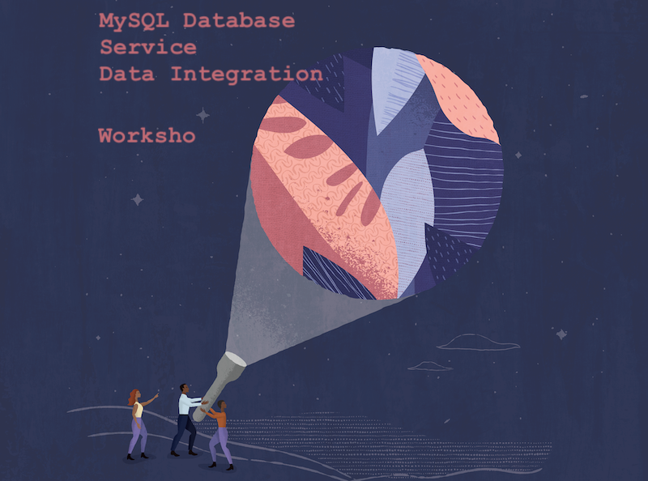

# MySQL, Data Integration and Data Science Workshop

## Conversational Approach to Your Applications

This workshop walks you through the steps to use **MySQL Database Service**, **Data Integrator** and **Data Science** to extract a dataset, apply some transformations, load the data into MySQL and run analytics with Jupyter Notebook.

## Who Should Do This Workshop

You want to **build a pipeline** for your data and run analytics with your favourite Python libraries on **Jupyter Notebook**.

You want to **learn Oracle Cloud Infrastructure**.

You don't want to spend a dime until you are happy with the workflow.

## Content

[Get Started: Sign Up for your Oracle Cloud Free Tier](lab0/README.md)

- Create Your Free Trial Account
- Sign in to Your Account

[Lab 1: Create MySQL Database Service](lab1/README.md)

- Create an instance of MySQL in the cloud
- XXX

[Lab 2: Create Data Integrator instance](lab2/README.md)

- Create Your OCI Data Integrator instance
- XXX

[Lab 3: Design and Run your ETL pipeline](lab3/README.md)

- XXX

[Lab 4: Transform your Data into Insights](lab4/README.md)

- XXX

[Next Steps](next/README.md)

- Upgrade Instances to Paid
- Want to Learn More?
- Troubleshooting

## Requirements

XXX

---

## Let's Get Started

Sign Up for your Oracle Cloud Free Tier to [**Get Started!**](./lab0/README.md)