# Lab 1: Requirements


## Create Virtual Cloud Network (VCN)

We are going to create a network with a public subnet (with access from Internet) and a private subnet (no direct access from Internet). This layout is interesting to protect those services that don't want to be exposed to Internet from other services or machines that you want to be reachable.

Go to **Menu** > **Networking** > **Virtual Cloud Networks**:

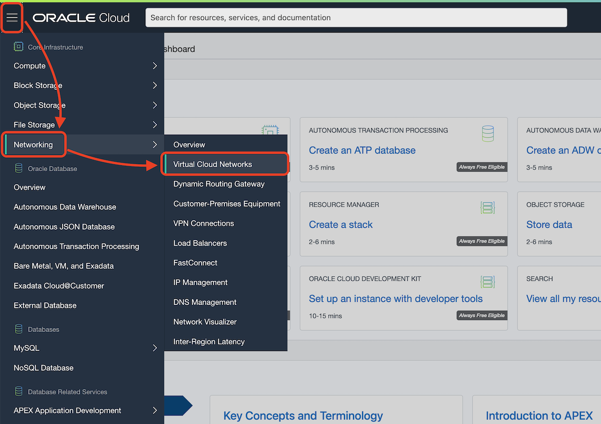

> If you have not pick a compartment, pick **root** compartment for this lab.
> 
> 

Click **Start VCN Wizard**.

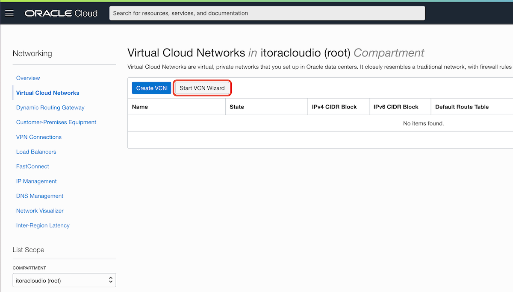

Select **VCN with Internet Connectivity**.

Click **Start VCN Wizard**.


Change the VCN name and leave everything else as default.

> VCN Name: `nature`

Click **Next**.

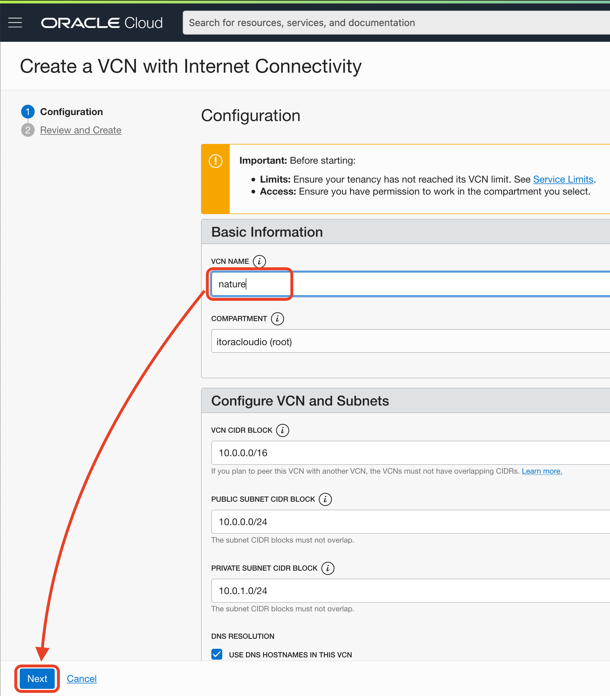

Review all the details and click **Create**.


The creation process takes few seconds. Confirm everything is created (green tick on all resources) before you continue.

Click **View Virtual Cloud Network**.


Go to your new **Private Subnet-nature** and click **Security List for Private Subnet-nature**.

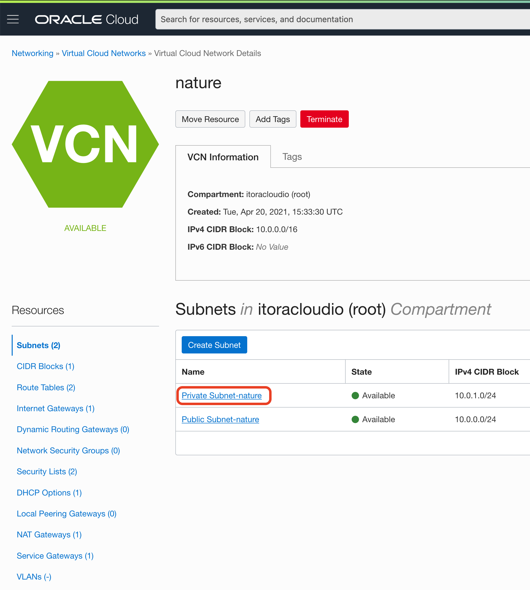

We need to open the ports for MySQL and MySQL X protocols: `3306` and `33060`.


We are adding a ingress rule on those ports from the internal VCN CIDR `10.0.0.0/16`.

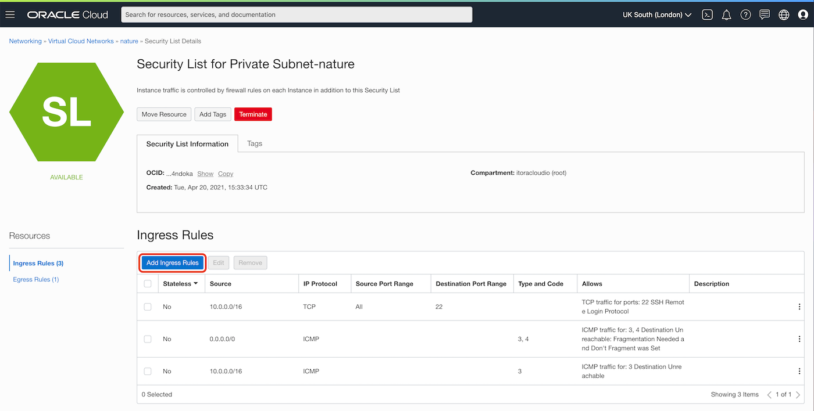

Click **Add Ingress Rules**` and fill the form with the following information:

> Source CIDR: `10.0.0.0/16`
> 
> Destination Port Range: `3306,33060`
> 
> Description: `MySQL and MySQL X Protocol`

Leave the rest of fields with default values.

Click **Add Ingress Rule** to confirm the values.


You can confirm the rules are added.


## Create Bastion Host

We are going to create a compute in the Public Subnet with a public IP, it will be our access point to public and private resources.

Go to **Menu** > **Compute** > **Instances**.

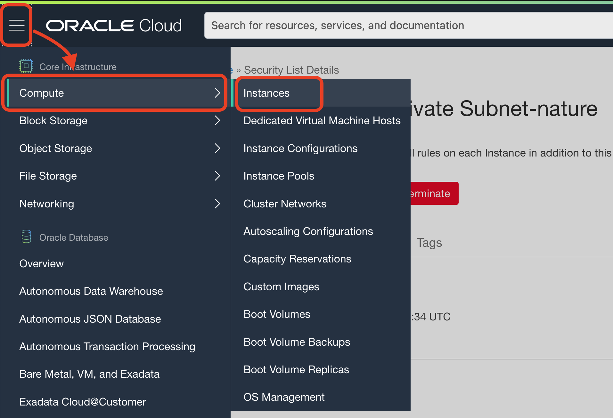

Click **Create Instance**.

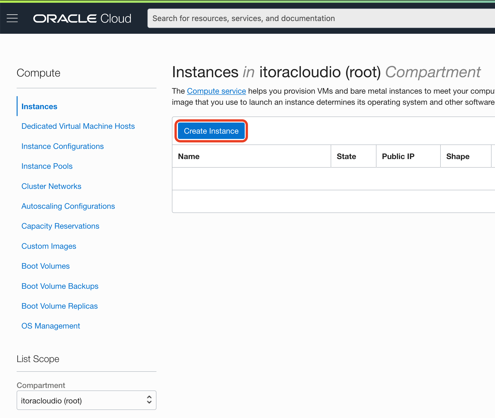

Change the name:

> Name: `bastion`

Make sure the networking is like the following:

> Image: `Oracle Linux 7.9`
>
> Shape: `VM.Standard.E2.1.Micro` for Always free or `VM.Standard.E3.Flex`
>
> Virtual cloud network: `nature`
>
> Subnet: `Public Subnet-nature`
>
> Assign a public IPv4 address: `Yes`

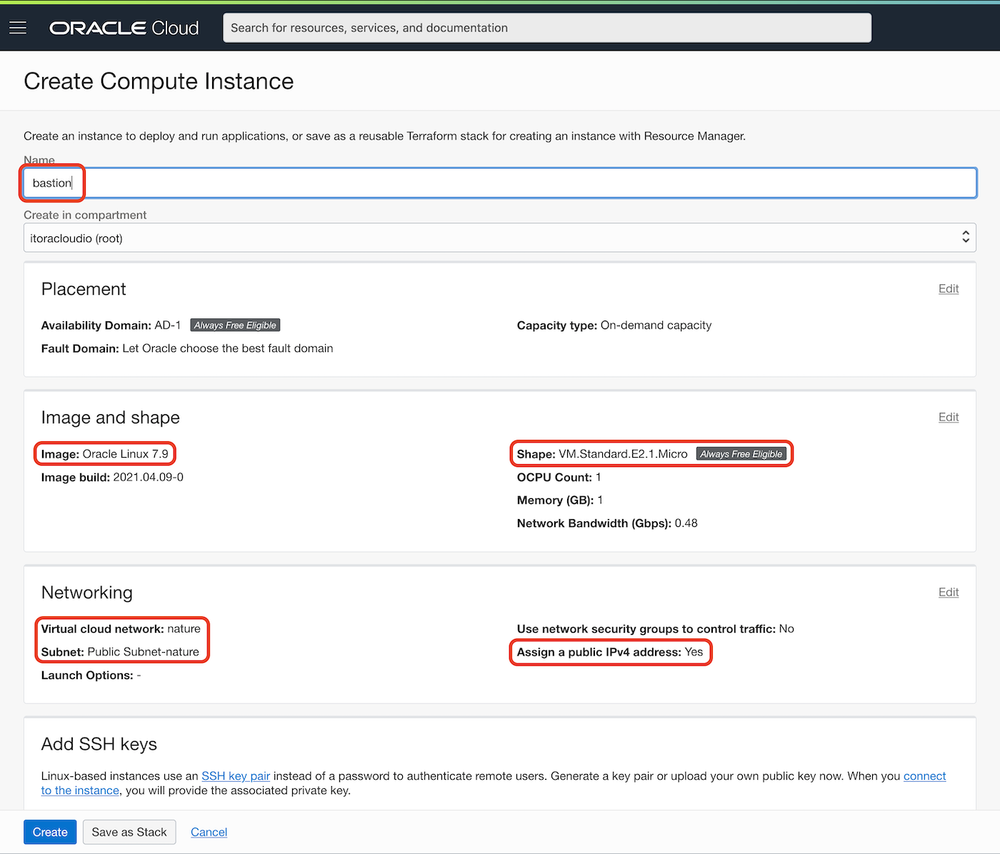

On the section Add SSH Keys

Make sure **Generate SSH Key pair** is checked.

Click **Save Private Key** and **Save Public Key**.

After the files are stored in your computer click **Create**.


The provisioning takes few minutes.


You can copy the assigned Public IP that we will use to SSH into the instance, also notice that the username is `opc`.

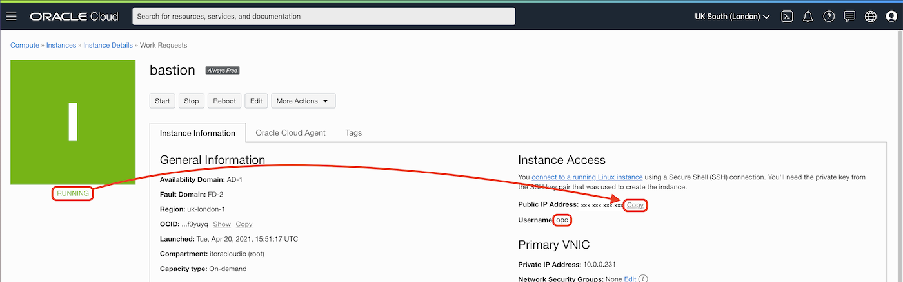

Make sure the Icon turn green and it says "RUNNING".

To avoid install tools on your local computer, we are going to use Cloud Shell. Cloud Shell is a small and free Linux virtual machine with a lot of DevOps tools preinstalled. Click on Cloud Shell icon on the top-right menu bar.


It will provision this small virtual machine and you will have access to its terminal from Oracle Cloud web console.


Create `.ssh` folder for your SSH keys.

```
mkdir .ssh
```

Move the key file to your `.ssh` folder with a different name `id_rsa`, which is a default name.

```
mv ssh-key-*.key .ssh/id_rsa
```

Connect with your bastion host with SSH.

```
ssh opc@PUBLIC_UP
```

To the question `Are you sure you want to continue connecting (yes/no/[fingerprint])?` type `yes` and ENTER.

You will get `bad permissions` warning. Basically the permissions of the key are too open. Security first.

```
Warning: Permanently added 'xxx.xxx.xxx.xxx' (ECDSA) to the list of known hosts.
@@@@@@@@@@@@@@@@@@@@@@@@@@@@@@@@@@@@@@@@@@@@@@@@@@@@@@@@@@@
@         WARNING: UNPROTECTED PRIVATE KEY FILE!          @
@@@@@@@@@@@@@@@@@@@@@@@@@@@@@@@@@@@@@@@@@@@@@@@@@@@@@@@@@@@
Permissions 0644 for '/home/it/.ssh/id_rsa' are too open.
It is required that your private key files are NOT accessible by others.
This private key will be ignored.
Load key "/home/it/.ssh/id_rsa": bad permissions
Permission denied (publickey,gssapi-keyex,gssapi-with-mic).
```

Let's fix the permissions to `600` with the following command:

```
chmod 600 .ssh/id_rsa
```

Connect with SSH again (remember to replace `PUBLIC_IP` with your bastion host IP):

```
ssh opc@PUBLIC_IP
```

This time you should be inside of the bastion host. This is the machine we will use to access MySQL Database System that lives in a private subnet, for security.

Install Docker:

```bash
sudo yum update -y && sudo yum install docker-engine -y
```

Start Docker Engine:

```
sudo systemctl start docker
```

Check it is running:

```
sudo systemctl status docker
```


If `active` then enable Docker as service.

```
sudo systemctl enable docker
```

> Optional, if you don't want to use `sudo` with every `docker` command:
>
> ```
> sudo usermod -aG docker $USER
> ```
> 
> For the changes to take place you need to `exit` and then `ssh` into the bastion host again

Let's pull Mysql as a docker container:

```
sudo docker pull mysql/mysql-server
```

You can close Cloud shell for now.

## Create Object Storage and upload files

Go to **Menu** > **Object Storage** > **Object Storage**.

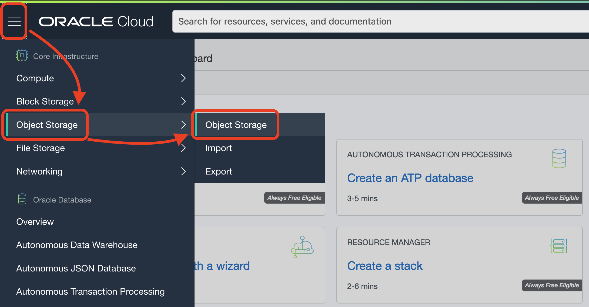

Click **Create Bucket**.

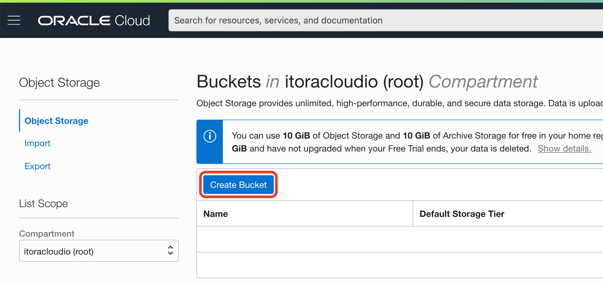

Change the bucket name, leave everything else by default. And click **Create**.

> Bucket Name: `bucket-study`


Click on your new `bucket-study` bucket to see details.

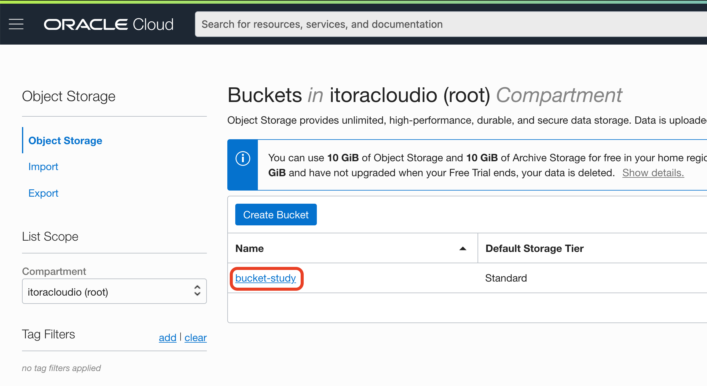

On the section **Objects** click **Upload**.


Download the dataset [Reef Life Survey Fish](./files/reef_life_survey_fish.csv)

Drop the file on **Choose Files from your Computer**. Leave everything else by default.


Click **Upload**.


Click **Close**.

You will see the new file in the Objects list. Click on the 3 dots contextual menu.


On the contextual menu, select **View Object Details**.


Take note of the URL you have. We will use it in the following Labs.


## Congratulations! You are ready to go to the next Lab!

---

[**<< Go to Sign Up**](../lab0/README.md) | [Home](../README.md) | [**Go to Lab 2 >>>>>**](../lab2/README.md)