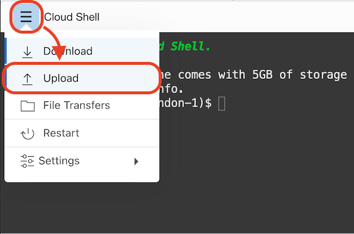
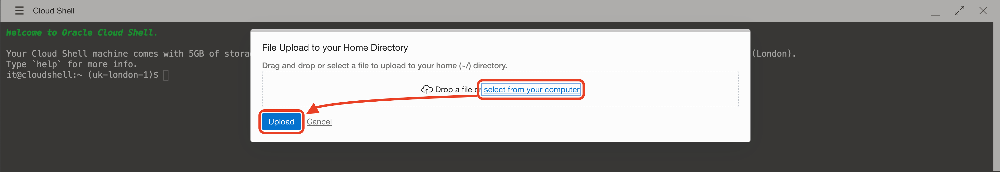
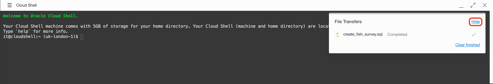

# Lab 2: Create MySQL Database System


**MySQL Database System** is a fully-managed Oracle Cloud Infrastructure service, developed, managed, and supported by the MySQL team in Oracle.

## Create an instance of MySQL in the cloud

Go to **Menu** > **MySQL** > **DB Systems**.


Click **Create MySQL DB System**.

Make sure your root compartment (or the one you want) is selected.


Name your MySQL instance

> Name: `mysql-analytics`
> 
> Description (optional): `MySQL instance for Analytics`

Between the three options, pick `HeatWave`. `Standalone` will work for the test, but it doesn't include the Analytics Engine that will improve performance for Analytics.

For Username and password

> Username: `root`
> 
> Password: `R2d2&C3po!`
> 
> Confirm Password: `R2d2&C3po!`


Network configuration:

> Virtual Cloud Network: `nature`
> 
> Subnet: `Private Subnet-nature (Regional)`


Everything else is good by default:

> Configure placement: `AD-1`
> 
> Configure hardware: `MySQL.HeatWave.VM.Standard.E3` or `MySQL.VM.Standard.E3.1.8GB` for Standalone (selected above)
> 
> Data Storage Size (GB): `50`
> 
> Configure Backups: `Enable Automatic Backups`

Click **Create**.


The provisioning is around 10 minutes. The icon should change to `ACTIVE` in green:


Copy the private IP address from the MySQL DB System Information page; it will look like `10.0.1.xxx`.


## Connect and create DB

Download the file [SQL Fish Survey](./files/create_fish_survey.sql), where we have the SQL code to create the schema and table to hold the data.

Let's upload the file to Cloud Shell and then to our Bastion host. From the bastion host, we can run MySQL Shell to run the SQL file.

Connect with Cloud Shell (if you close it or it is no longer active).


Click **Cloud Shell menu** and then **Upload**.



**Select** the file `create_fish_survey.sql` and click Upload.



**Hide** the popup window when completed.



Now, on the Cloud Shell terminal, we are going to copy the file into the bastion host with (replace `PUBLIC_IP` with your bastion host IP):

```
scp create_fish_survey.sql opc@PUBLIC_IP:/home/opc/
```

SSH into the bastion host and type:

```
ssh opc@PUBLIC_IP
```

Run a docker image with MySQL Shell:

```
sudo docker run -it --rm --name mysql -v $(pwd):/tmp mysql/mysql-server bash
```

When in the docker container, run the command with:

```
cat /tmp/create_fish_survey.sql | mysqlsh --sql root@<PRIVATE_IP>
```

It will ask for the password (`Please provide the password for 'root@PRIVATE_IP':`). Type the MySQL DB password `R2d2&C3po!`.

If there is no error on the console, everything is ready to proceed.


## Enable HeatWave

XXX

## Congratulations! You are ready to go to the next Lab!

---

[**<< Go to Lab 1**](../lab1/README.md) | [Home](../README.md) | [**Go to Lab 3 >>>>>**](../lab3/README.md)