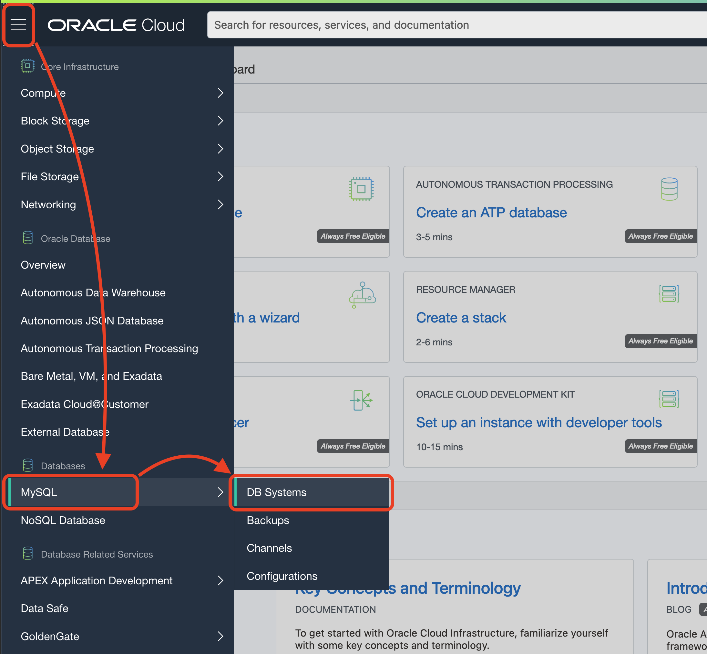
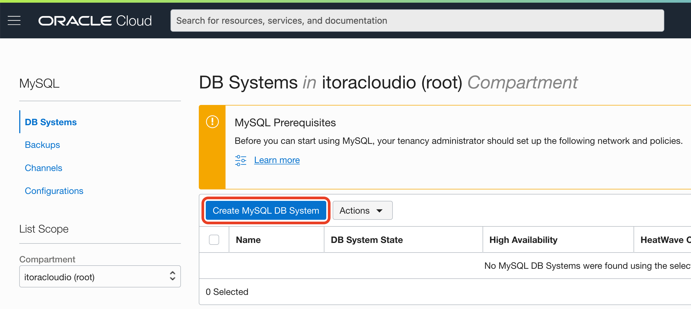
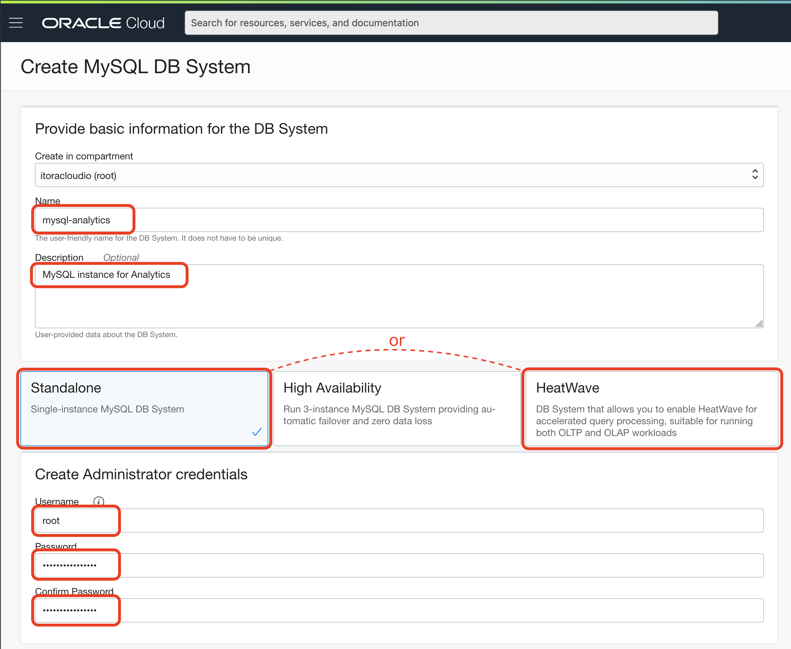
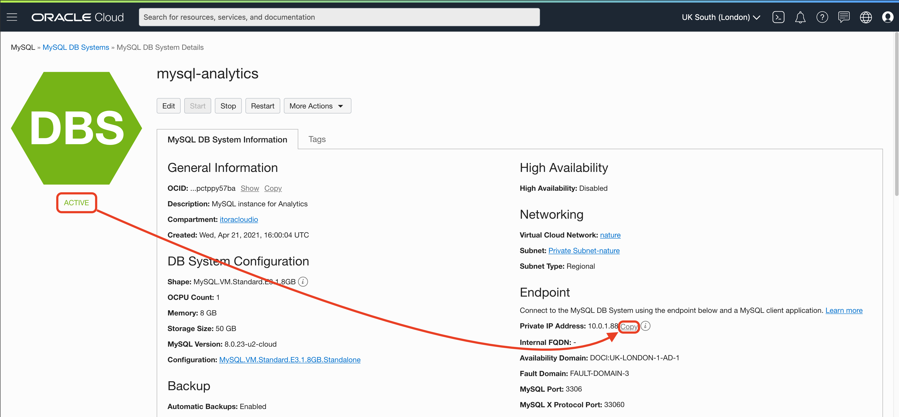
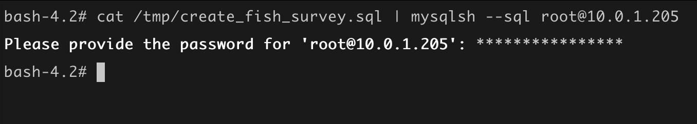

# Lab 2: Create MySQL Database System


**MySQL Database System** is a fully-managed Oracle Cloud Infrastructure service, developed, managed, and supported by the MySQL team in Oracle.

## Create an instance of MySQL in the cloud

Go to **Menu** > **Databases** > **DB Systems**.



Click **Create MySQL DB System**.

Make sure your root compartment (or the one you want) is selected.



Name your MySQL instance

Name: 

```
mysql-analytics
```

Description (optional): 

```
MySQL instance for Analytics
```

Between the three options, pick `HeatWave`. `Standalone` will work for the test, but it doesn't include the Analytics Engine that will improve performance for Analytics.

For Username and password

Username: 

```
root
```

Password: 

```
R2d2&C3po!
```

Confirm Password: 

```
R2d2&C3po!
```



Network configuration:

Virtual Cloud Network: 

```
nature
```

Subnet: 

```
Private Subnet-nature (Regional)
```


Everything else is good by default:

Configure placement: 

```
AD-1
```

Configure hardware: 

```
MySQL.HeatWave.VM.Standard.E3
```

or Standalone (selected above)

```
MySQL.VM.Standard.E3.1.8GB
```

Data Storage Size (GB): 

```
50
```

Configure Backups: 

```
Enable Automatic Backups
```

Click **Create**.


The provisioning is around 10 minutes. The icon should change to `ACTIVE` in green:


Copy the private IP address from the MySQL DB System Information page; it will look like `10.0.1.xxx`.



## Connect and create DB

Connect with Cloud Shell (if you close it or it is no longer active).


SSH into the bastion host:

```
ssh -i ~/.ssh/bastion opc@PUBLIC_IP
```

Run MySQL Shell (repalce `PRIVATE_IP` with your MDS IP value):
```
curl https://raw.githubusercontent.com/vmleon/mysql-dataintegrator-datascience-workshop/main/lab2/files/create_fish_survey.sql | mysqlsh --sql root@10.0.1.112
```

It will ask for the password (`Please provide the password for 'root@PRIVATE_IP':`). Type the MySQL DB password:

```
R2d2&C3po!
```

If there is no error on the console, everything is ready to proceed.



## Enable HeatWave

If you have select the HeatWave Shape `MySQL.HeatWave.VM.Standard.E3`, you should be able to enable HeatWave Analytics Engine.

Go to the **Resources Menu** > **HeatWave**.


Your HeatWave is disabled, add the HeatWave Cluster. Click **Add HeatWave Cluster**.


Check the values, and click **Add HeatWave Cluster**.


Wait for the Cluster to be created.


HeatWave will be `Active` and the cluster nodes will be as well in `Active` state.


## Congratulations! You are ready to go to the next Lab!

---

[**<< Go to Lab 1**](../lab1/README.md) | [Home](../README.md) | [**Go to Lab 3 >>>>>**](../lab3/README.md)