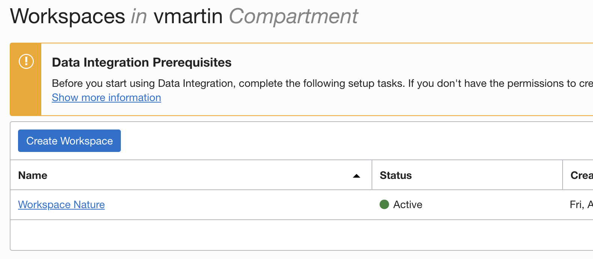

# Lab 3: Create Data Integrator instance


This lab walks you through the steps to get started using **Data Integrator** on Oracle Cloud Infrastructure (OCI). You will provision a new instance in just few minutes.

Oracle Cloud Infrastructure Data Integration is a fully managed, serverless, native cloud service that helps you with common extract, load, and transform (ETL) tasks such as ingesting data from different sources, cleansing, transforming, and reshaping that data, and then efficiently loading it to target data sources on Oracle Cloud Infrastructure.

| Role           | Responsibilities                                                                       |
| -------------- | -------------------------------------------------------------------------------------- |
| Administrators | Oversee, manage and monitor lifecycle management and security policies for the service |
| Data Engineers | Develop, build and test data integration solutions                                     |
| Operators      | Manage, monitor, and diagnose data integration executions                              |

## Create Your OCI Data Integrator instance

[Getting Started with Data Integration](https://docs.oracle.com/en-us/iaas/data-integration/using/preparing-for-connectivity.htm)

Requirements

VCN

If not administrator:

```
allow group <group-name> to inspect compartments in tenancy
allow service dataintegration to use virtual-network-family in compartment <your_compartment>
```

Non-admin users
```
allow group <group-name> to manage dis-workspaces in compartment <compartment-name>
allow group <group-name> to manage dis-work-requests in compartment <compartment-name>
allow group <group-name> to use virtual-network-family in compartment <compartment-name>
allow group <group-name> to manage tag-namespaces in compartment <compartment-name>
```

To use Object Storage
```
allow group <group_name> to use object-family in compartment <compartment-name>
allow any-user to use buckets in compartment <compartment-name> where ALL {request.principal.type='disworkspace', request.principal.id='<workspace_ocid>'}
allow any-user to manage objects in compartment <compartment-name> where ALL {request.principal.type='disworkspace',request.principal.id='<workspace_ocid>'}
```

To Use ADB
```
allow any-user {PAR_MANAGE} in compartment <compartment-name> where ALL {request.principal.type='disworkspace', request.principal.id='<workspace_ocid>'}
```

> Data Integration Service should have network access to the sources and targe

Go to Menu > Data Integration.

Click **Create Workspace**.

Modify the following fields, leave the rest as default:

> Name: `Workspace Nature`
> 
> VCN: `nature`
> 
> Subnet: `Private subnet-nature`

Click **Create**.

You will see the new workspace in Creating status.


Wait for provisioning. (~9min)

You will see a success creation.



Click on the new `Workspace Nature`.

You can see that by default there is a `Default Application` and a project `My First Project`.

The first task is to create the data assets that represent the source and target for the data integration. In our case, the data source is an Object Storage bucket and the target is our MySQL database.

## Create the Data Assets

We are going to need the Object Storage URL and Tenancy ID.

### Get Object Storage URL

Go to Object Storage > `bucket-study`.

On your `reef_life_survey_fish.csv` click on the 3 dots contextual menu and click on **View Object Details**.

Copy the first part of the URL, like here `https://objectstorage.eu-frankfurt-1.oraclecloud.com`.

### Get Tenancy OCID

Go to Profile > Tenancy.

Copy the OCID. Write it down for the next step.

> You can see that the Object Storage Namespace is here too, in case you need it in the future.

Let's create the Data Asset now.

Click **Create Data Asset**.

Fill the fields as follows:

> Name: `bucket-study`
> 
> Description: `Object Storage Bucket with fish survey`
> 
> Type: `Oracle Object Storage`
> 
> URL: `https://objectstorage.<REGION>.oraclecloud.com`
> 
> Tenancy OCID: `ocid1.tenancy.oc1..muahahahahahahahaha`
>
> Click outside the Tenancy OCID field and after few seconds an OS Namespace will be retrieved automatically.

You can test the connection.

Click **Create**.

Go back to Home and Click **Create Data Assets** again. This time we are going to create the MySQL database asset with the following values:

> Name: `mysql-database`
> 
> Description: `MySQL Database for Analytics`
> 
> Type: `MySQL`
> 
> Host: `10.0.1.x` (from MySQL created instance)
> 
> Port: `3306`
> 
> Database: `nature`
> 
> User: `root`
> 
> Password: `R2d2&C3po!`

You can test the connection.

Click **Create**.

## Create the Data Flow

Go back to Home and Click **Create Data Flow**.

Set the Name, Project and Description in the New Data Flow Panel

> Name: `CSV to MySQL`
> 
> Project or Folder: `My First Project`
> 
> Description: `Data Flow from CSV on Object Storage to MySQL Database`

Drag and Drop the Source icon into the canvas.

Set the Identifier and the rest of the info in the Source:

> Identifier: `FISH_SURVEY`
> 
> Data Asset: `bucket-study`
> 
> Connection: `Default Connection`
> 
> Schema: `bucket-study`
> 
> Data entity: click **Browse By Name** and select `reef_life_survey_fish.csv`, all the default values are good, click **Select**.

Confirm you can see attributes and Data.

Drag and Drop the Target icon into the canvas.

Set the Identifier and the rest of the info in the Target:

> Identifier: `MySQL DB`
> 
> Data Asset: `mysql-database`
> 
> Connection: `Default Connection`
> 
> Schema: `nature`
> 
> Data entity: `fish`

Confirm you can see attributes and data.

Connect `FISH_SURVEY` with `MYSQL_DB`.

Map manually the attributes until they are all mapped.

Click **Save and Close**.

## Create the Integration Task

Go back to Home and Click **Create Integration Task**.

Set the Name and the rest of the info as follows:

> Name: `IntegrationTaskMySQL`
> 
> Description: `Integration Task MySQL`
> 
> Project or Folder: `My First Project`
> 
> Data Flow: `CSV to MySQL`

Click **Save and Close**.

## Publish the Integration Task

Go to **Projects**.

Click on **My First Project**.

On the Details menu (left), click on **Tasks**.

Select **IntegrationTaskMySQL** and click **Publish to Application**.

Select (if not selected by default) your **Default Application**. Click **Publish**.

## Run the Task

Go back **Home** and click **Applications**.

Select **Default Application** and you will see your task **IntegrationTaskMySQL**.

Click on the context menu (three dots) and click **Run**.

Wait few seconds and the Status will change from `Not Started` to `Queued`, then to `Running`. Feel free to click **Refresh** from time to time until you see `Success` on the Status.

## It works

On the bastion host, in `mysqhlsh` run a query to check the number of rows in `fish` table.

```sql
select count(1) from fish;
```

## Congratulations, you are ready for the next Lab!

---

[**<< Go to Lab 2**](../lab2/README.md) | [Home](../README.md) | [**Go to Lab 4 >>>>>**](../lab4/README.md)