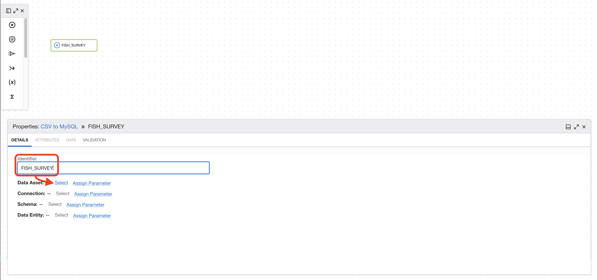
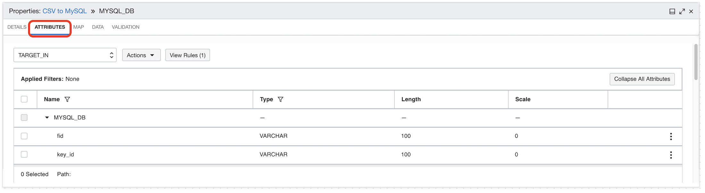
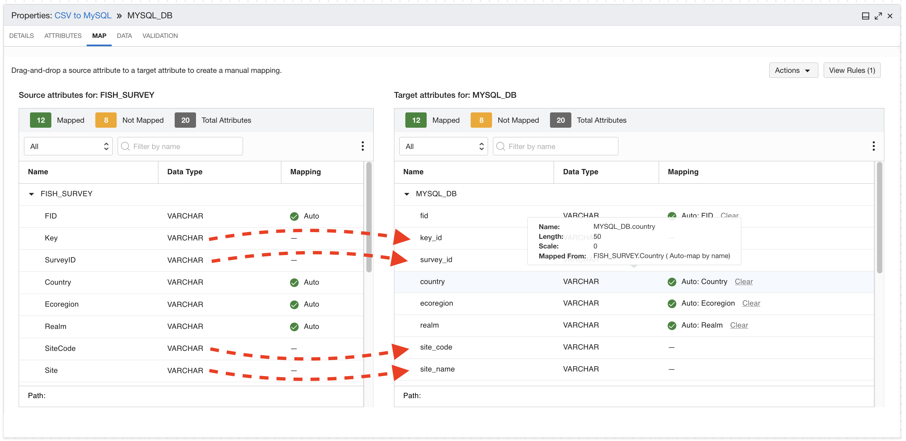

# Lab 3: Create Data Integrator instance


This lab walks you through the steps to get started using **Data Integrator** on Oracle Cloud Infrastructure (OCI). You will provision a new instance in just few minutes.

OCI Data Integration is a fully managed, serverless, native cloud service that helps you with common extract, load, and transform (ETL) tasks such as ingesting data from different sources, cleansing, transforming, and reshaping that data, and then efficiently loading it to target data sources on OCI.

## Create Your OCI Data Integrator instance

We need to create some policies to allow Data Integrator service to use other services within OCI.

Go to **Identity** > **Policies**.


Click **Create Policy**.


Create a new policy

> Name: `dataintegration`
> 
> Description: `Allow Data Integration Service to use VCN`
>
> Toogle: `Show manual editor`
> 
> Policy Builder: `allow service dataintegration to use virtual-network-family in tenancy`


> If you have created an Oracle Cloud Account to do the workshop, you are already the Administrator. You DO NOT NEED TO DO THIS STEP.
> 
> In case you are a Non-admin user, you will need to set up some more policies to allow the group you belong to. Ask your administrator.
> 
> ```
> allow group <group-name> to manage dis-workspaces in compartment <compartment-name>
> allow group <group-name> to manage dis-work-requests in compartment <compartment-name>
> allow group <group-name> to use virtual-network-family in compartment <compartment-name>
> allow group <group-name> to manage tag-namespaces in compartment <compartment-name>
> ```

Go to **Menu** > **Data Integration**.


Click **Create Workspace**.


Modify the following fields, leave the rest as default:

> Name: `Workspace Nature`
> 
> VCN: `nature`
> 
> Subnet: `Private subnet-nature`

Click **Create**.


While the Workspace is created, click the 3 dots contextual menu.


Then click **Copy OCID**.


Go to **Identity** > **Policies**. We are going to add new policies for our new workspace.


Click on `dataintegration` policy name.


Click **Edit Policy Statements**.


Click **+ Another Statement**.


Add 2 more statements and make sure you set the workspace OCID. It will look like this one: 

The first statement:

```
allow any-user to use buckets in tenancy where ALL {request.principal.type='disworkspace', request.principal.id='ocid1.disworkspace.oc1.XX-XXXXXXX-1.XXXXXXXXXXXXXXXXXXX'}
```

The second statement:

```
allow any-user to manage objects in tenancy where ALL {request.principal.type='disworkspace',request.principal.id='ocid1.disworkspace.oc1.XX-XXXXXXX-1.XXXXXXXXXXXXXXXXXXX'}
```

Click **Save Changes**.


Come back to Data Integration, Click **Menu** > **Data Integration**.


Check the Data Integration Workspace is `Active` and click the link.


## Create the Data Assets

We are going to need the Object Storage URL and Tenancy ID.

### Get Object Storage URL

Go to Object Storage.


Click on `bucket-study`.


On your `reef_life_survey_fish.csv` click on the 3 dots contextual menu.


Click on **View Object Details**.


Copy the first part of the URL domain, something like here `https://objectstorage.uk-london-1.oraclecloud.com`.


### Get Tenancy OCID

Go to Profile on the top-right corner.

Click on Tenancy.


Tenancy details contains a lot of interesting information. Your Home Region, your **CSI number** for creating support tickets. Also your **Object Storate Namespace**. 

At this point we are interested in the Tenancy OCID. Copy the OCID by clicking on **Copy**. Write it down for the next step.


> You can see that the Object Storage Namespace is here too, in case you need it in the future.

Let's create the Data Asset now.

You can see that by default there is a `Default Application` and a project `My First Project`.


The first task is to create the data assets that represent the source and target for the data integration. In our case, the data source is an Object Storage bucket and the target is our MySQL database.

Click **Create Data Asset**.


Fill the fields as follows:

> Name: `bucket-study`
> 
> Description: `Object Storage Bucket with fish survey`
> 
> Type: `Oracle Object Storage`
> 
> URL: `https://objectstorage.<REGION>.oraclecloud.com`
> 
> Tenancy OCID: `ocid1.tenancy.oc1..muahahahahahahahaha`
>
> Click outside the Tenancy OCID field and after few seconds an OS Namespace will be retrieved automatically.


You can test the connection.


After you get a successful test, click **Create**.


Go back to Home.


Click **Create Data Assets** again.


This time we are going to create the MySQL database asset with the following values:

> Name: `mysql-database`
> 
> Description: `MySQL Database for Analytics`
> 
> Type: `MySQL`
> 
> Host: `10.0.1.x` (from MySQL created instance)
> 
> Port: `3306`
> 
> Database: `nature`
> 
> User: `root`
> 
> Password: `R2d2&C3po!`


You can test the connection.

Click **Create**.


When the data asset is created, go back to Home.


## Create the Data Flow

Click **Create Data Flow**.


Set the Name, Project and Description in the New Data Flow Panel

> Name: `CSV to MySQL`
> 
> Project or Folder: `My First Project`
> 
> Description: `Data Flow from CSV on Object Storage to MySQL Database`

To select the Project, click on `My First Project` and **Select**.


It should look like this:


From the Operators panel, drag and drop the Source icon into the canvas.


Set the Identifier and the rest of the info in the Source Properties panel:

> Identifier: `FISH_SURVEY`
> 
> Data Asset: `bucket-study`
> 
> Connection: `Default Connection`
> 
> Schema: `bucket-study`
> 
> Data entity: click **Browse By Name** and select `reef_life_survey_fish.csv`, all the default values are good, click **Select**.

Set the Identifier and tehn go to Data Asset and click Select.



From the dropdown, select `bucket-study`. Select `Default Connection` and for schema the name of the bucket `bucket-study`,


Finally, select the Data Entity.


Browse by Name:


Select `reef_life_survey_fish.csv` file.


And click **Select**.


On the dropdown for **File Type**, pick `CSV`.


Then click **Select**.


At this point, your source has access to the Attributes where you can see the different fields of your dataset.


Confirm you can see attributes and Data.

Let's move into the target for our MySQL Database.

Drag and Drop the Target icon into the canvas.


Set the Identifier and the rest of the info in the Target:

> Identifier: `MySQL DB`
> 
> Data Asset: `mysql-database`
> 
> Connection: `Default Connection`
> 
> Schema: `nature`
> 
> Data entity: `fish`


This time, pick the `mysql-database` data asset. And `Default Connection` one more.


For the Schema, select `nature`.


For Data Entity, we select the table `fish`.


At this point we can confirm we see the attributes from the table.



Time to wire source and target. Drag and drop the link between `FISH_SURVEY` and `MYSQL_DB`.


To build the link between source and target.


Click on the **Map** tab on the Properties panel and drag and drop the `Not Mapped` fields until they are all mapped.



Make sure `Not Mapped` in yellow is 0.


The final step is to validate the Data flow. Click Validate, check there are no warnings or errors and click **Save and Close**.


## Create the Integration Task

Go back to Home and Click **Create Integration Task**.


Set the Name and the rest of the info as follows:

> Name: `IntegrationTaskMySQL`
> 
> Description: `Integration Task MySQL`
> 
> Project or Folder: `My First Project`
> 
> Data Flow: `CSV to MySQL`


Wait for the Validation of the Data Flow and click **Save and Close**.


## Publish the Integration Task

Go to **Projects** on the home screen.


Click on **My First Project**.


On the Details menu (left), click on **Tasks**.


Select **IntegrationTaskMySQL** and click **Publish to Application**.


Select (if not selected by default) your **Default Application**. Click **Publish**.


## Run the Task

Go back  to the **Home** screen and click **Applications**.


Select **Default Application** and you will see your task **IntegrationTaskMySQL**.


Click on the context menu (three dots) and click **Run**.


Wait few seconds and the Status will change from `Not Started` to `Queued`, then to `Running`.


Feel free to click **Refresh** from time to time until you see `Success` on the Status.


## It works

On the bastion host in Cloud Shell (reconnect if timed out), and in the Terminal, run:

```
mysqhlsh
```

Run a query to check the number of rows in `fish` table.

Change to SQL mode:

```
\sql
```

Set `nature` as the schema in use.

```
use nature;
```

Count the number of rows in the table `fish`.

```sql
select count(1) from fish;
```

## Congratulations, you are ready for the next Lab!

---

[**<< Go to Lab 2**](../lab2/README.md) | [Home](../README.md) | [**Go to Lab 4 >>>>>**](../lab4/README.md)