# Lab 3: Create Data Integrator instance


This lab walks you through the steps to get started using **Data Integrator** on Oracle Cloud Infrastructure (OCI). You will provision a new instance in just few minutes.

OCI Data Integration is a fully managed, serverless, native cloud service that helps you with common extract, load, and transform (ETL) tasks such as ingesting data from different sources, cleansing, transforming, and reshaping that data, and then efficiently loading it to target data sources on OCI.

## Create Your OCI Data Integrator instance

We need to create some policies to allow Data Integrator service to use other services within OCI.

Go to **Identity** > **Policies**.

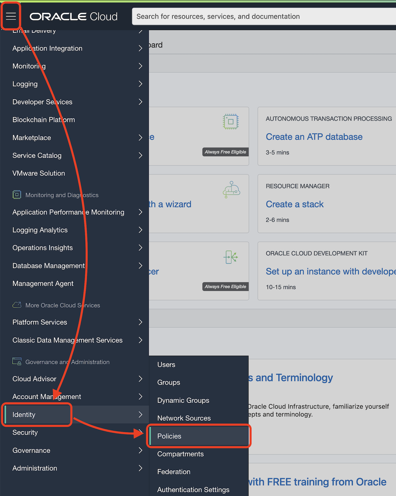

Click **Create Policy**.

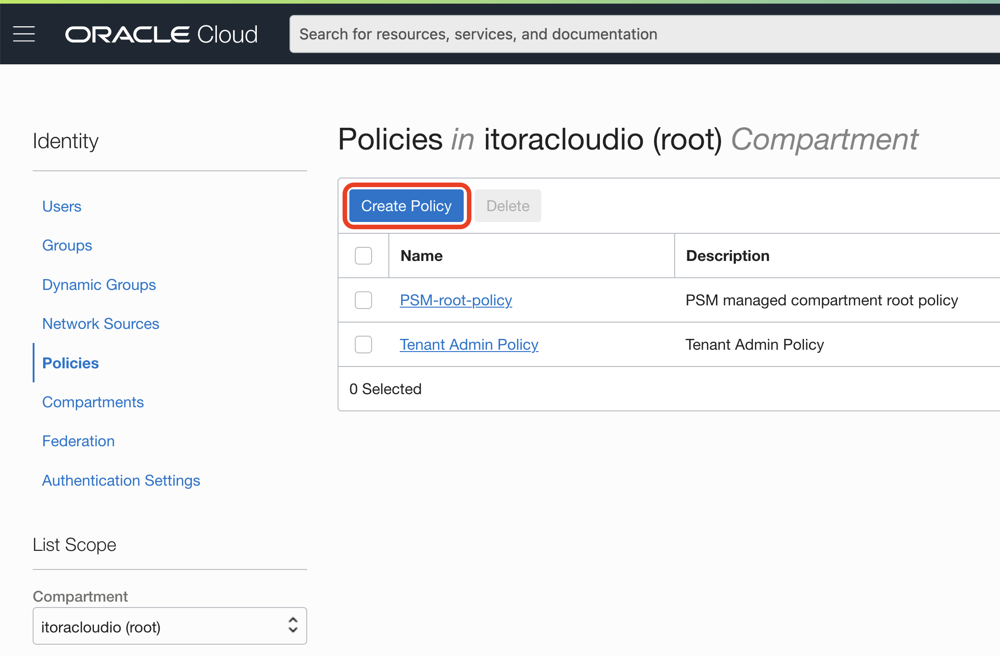


Create a new policy

> Name: `dataintegration`
> 
> Description: `Allow Data Integration Service to use VCN`
>
> Toogle: `Show manual editor`
> 
> Policy Builder: `allow service dataintegration to use virtual-network-family in tenancy`

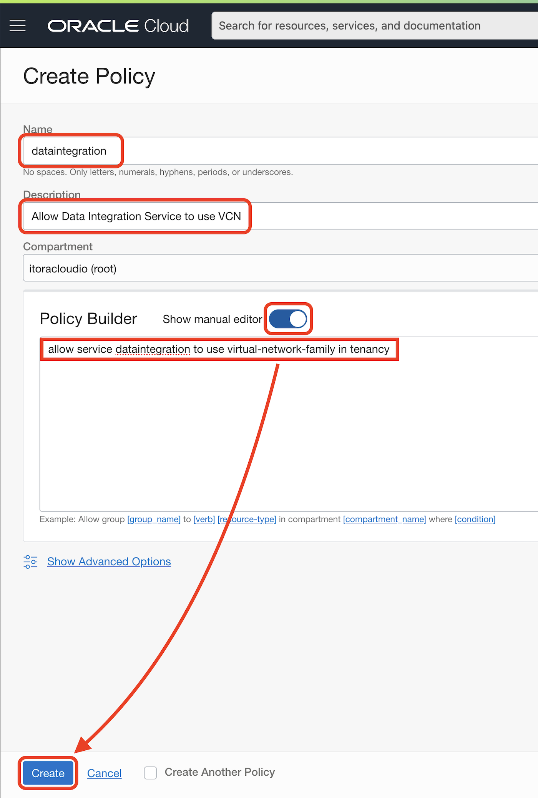


> If you have created an Oracle Cloud Account to do the workshop, you are already the Administrator. You DO NOT NEED TO DO THIS STEP.
> 
> In case you are a Non-admin user, you will need to set up some more policies to allow the group you belong to. Ask your administrator.
> 
> ```
> allow group <group-name> to manage dis-workspaces in compartment <compartment-name>
> allow group <group-name> to manage dis-work-requests in compartment <compartment-name>
> allow group <group-name> to use virtual-network-family in compartment <compartment-name>
> allow group <group-name> to manage tag-namespaces in compartment <compartment-name>
> ```

Go to **Menu** > **Data Integration**.

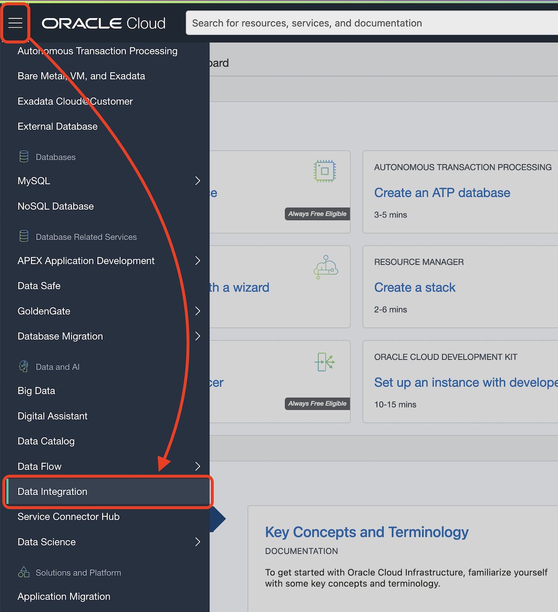

Click **Create Workspace**.

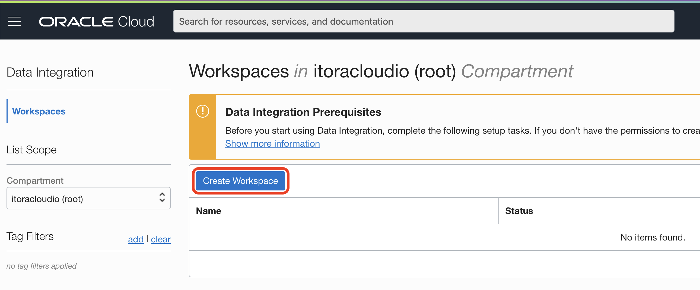

Modify the following fields, leave the rest as default:

> Name: `Workspace Nature`
> 
> VCN: `nature`
> 
> Subnet: `Private subnet-nature`

Click **Create**.


While the Workspace is created, click the 3 dots contextual menu.

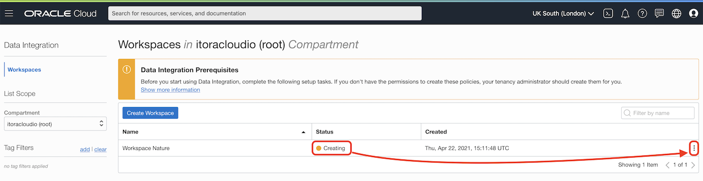

Then click **Copy OCID**.


Go to **Identity** > **Policies**. We are going to add new policies for our new workspace.

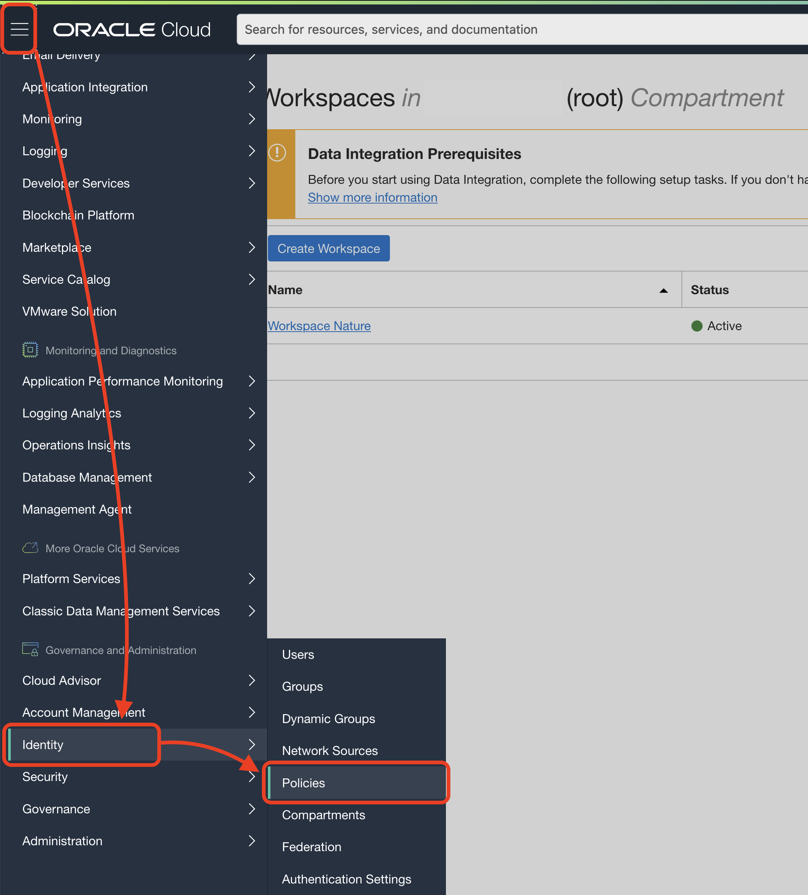

Click on `dataintegration` policy name.

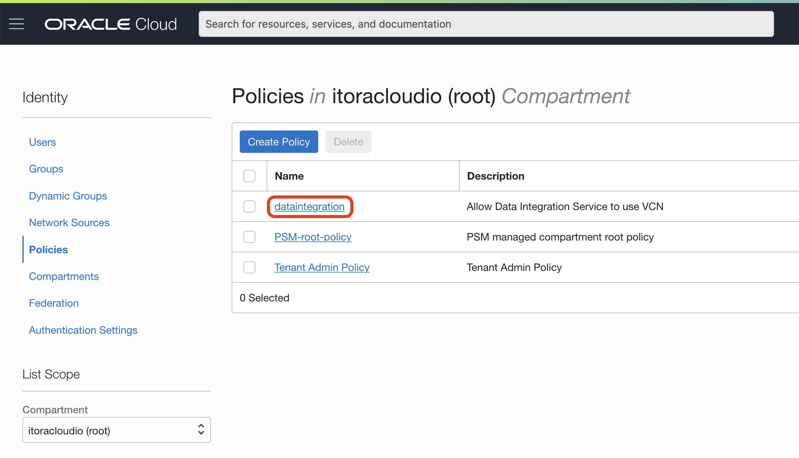

Click **Edit Policy Statements**.

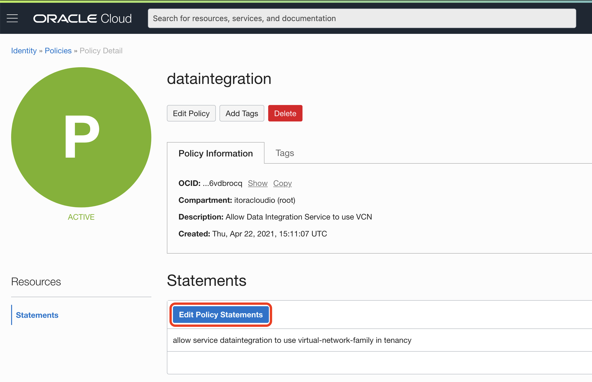

Click **+ Another Statement**.


Add 2 more statements and make sure you set the workspace OCID. It will look like this one: 

The first statement:

```
allow any-user to use buckets in tenancy where ALL {request.principal.type='disworkspace', request.principal.id='ocid1.disworkspace.oc1.XX-XXXXXXX-1.XXXXXXXXXXXXXXXXXXX'}
```

The second statement:

```
allow any-user to manage objects in tenancy where ALL {request.principal.type='disworkspace',request.principal.id='ocid1.disworkspace.oc1.XX-XXXXXXX-1.XXXXXXXXXXXXXXXXXXX'}
```

Click **Save Changes**.


Come back to Data Integration, Click **Menu** > **Data Integration**.

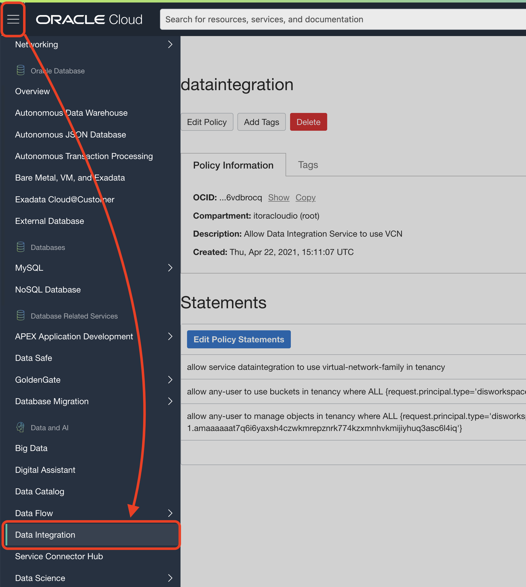

Check the Data Integration Workspace is `Active` and click the link.

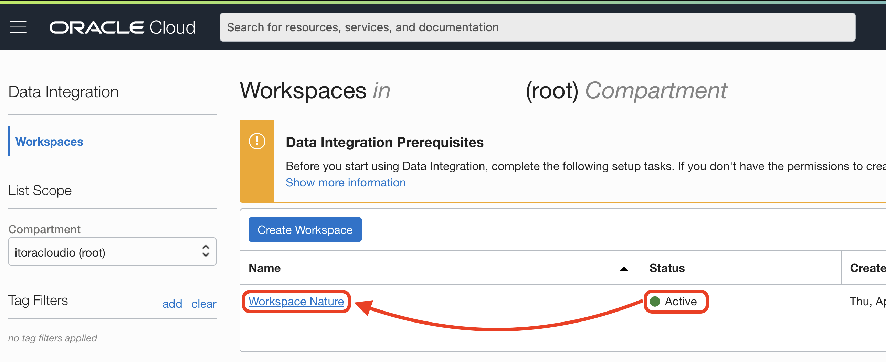

## Create the Data Assets

We are going to need the Object Storage URL and Tenancy ID.

### Get Object Storage URL

Go to Object Storage.


Click on `bucket-study`.

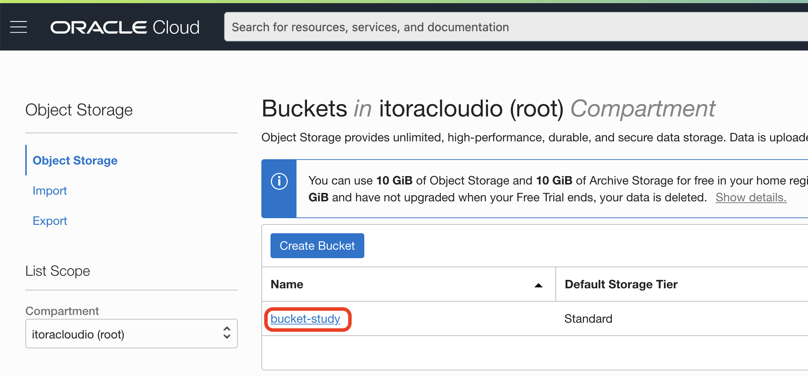

On your `reef_life_survey_fish.csv` click on the 3 dots contextual menu.

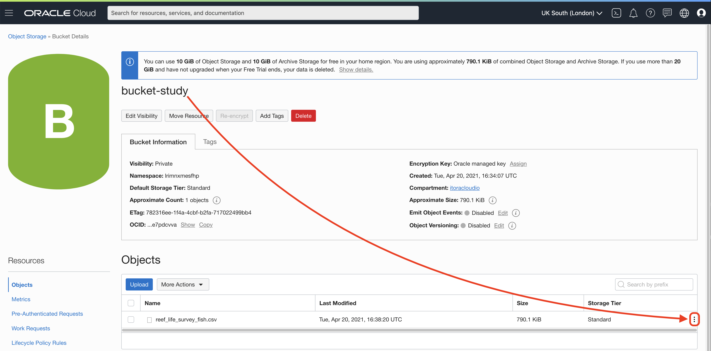

Click on **View Object Details**.


Copy the first part of the URL domain, something like here `https://objectstorage.uk-london-1.oraclecloud.com`.


### Get Tenancy OCID

Go to Profile on the top-right corner.

Click on Tenancy.

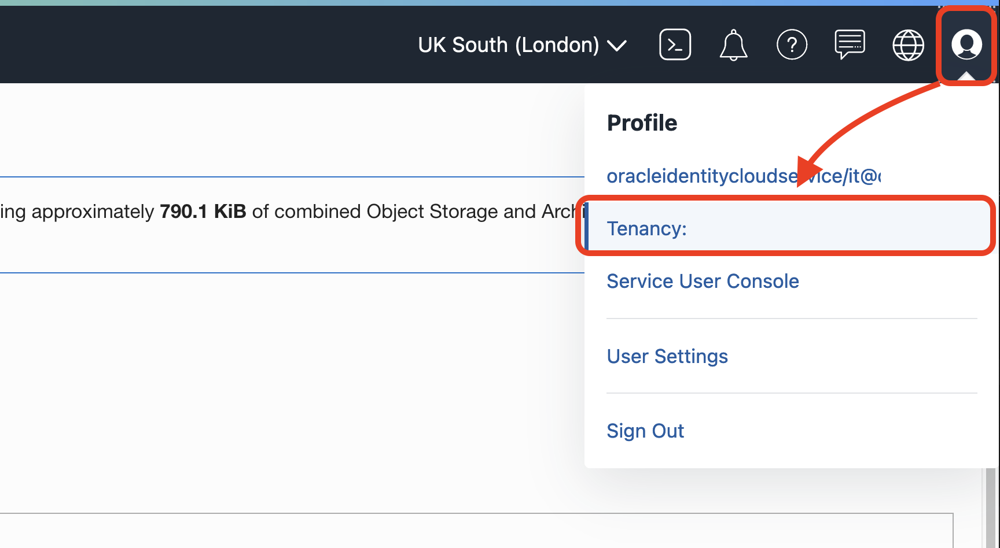

Tenancy details contains a lot of interesting information. Your Home Region, your **CSI number** for creating support tickets. Also your **Object Storate Namespace**. 

At this point we are interested in the Tenancy OCID. Copy the OCID by clicking on **Copy**. Write it down for the next step.


> You can see that the Object Storage Namespace is here too, in case you need it in the future.

Let's create the Data Asset now.

You can see that by default there is a `Default Application` and a project `My First Project`.


The first task is to create the data assets that represent the source and target for the data integration. In our case, the data source is an Object Storage bucket and the target is our MySQL database.

Click **Create Data Asset**.


Fill the fields as follows:

> Name: `bucket-study`
> 
> Description: `Object Storage Bucket with fish survey`
> 
> Type: `Oracle Object Storage`
> 
> URL: `https://objectstorage.<REGION>.oraclecloud.com`
> 
> Tenancy OCID: `ocid1.tenancy.oc1..muahahahahahahahaha`
>
> Click outside the Tenancy OCID field and after few seconds an OS Namespace will be retrieved automatically.

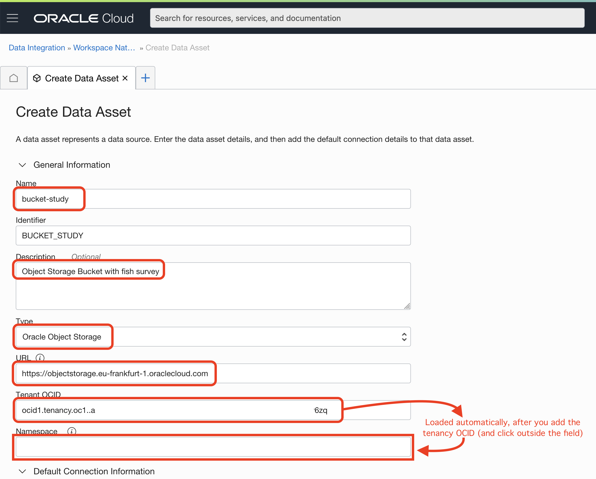

You can test the connection.


After you get a successful test, click **Create**.


Go back to Home.


Click **Create Data Assets** again.


This time we are going to create the MySQL database asset with the following values:

> Name: `mysql-database`
> 
> Description: `MySQL Database for Analytics`
> 
> Type: `MySQL`
> 
> Host: `10.0.1.x` (from MySQL created instance)
> 
> Port: `3306`
> 
> Database: `nature`
> 
> User: `root`
> 
> Password: `R2d2&C3po!`


You can test the connection.

Click **Create**.


When the data asset is created, go back to Home.


## It works

XXX

## Congratulations, you are ready for the next Lab!

---

[**<< Go to Lab 2**](../lab2/README.md) | [Home](../README.md) | [**Go to Lab 4 >>>>>**](../lab4/README.md)