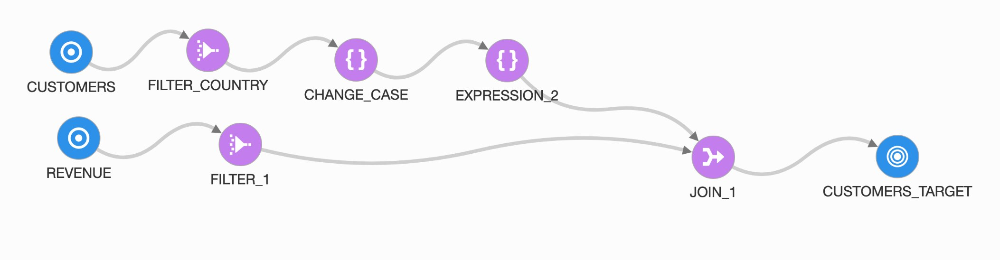

# Design and Run your ETL Pipeline.



## Introduction

A data flow is a visual program representing the flow of data from source data assets, such as a database or flat file, to target data assets, such as a data lake or data warehouse.

The flow of data from source to target can undergo a series of transforms to aggregate, cleanse, and shape the data.

Data engineers and ETL developers can then analyze or gather insights and use that data to make business decisions.

### Objectives

## STEP 1: Create the Data Flow

1. Click **Create Data Flow**.

    

2. Set the Name, Project and Description in the New Data Flow Panel

    - Name: `CSV to MySQL`
    - Project or Folder: `My First Project`
    - Description: `Data Flow from CSV on Object Storage to MySQL Database`

3. To select the Project, click on `My First Project` and **Select**.

    

    It should look like this:

    

4. From the Operators panel, drag and drop the Source icon into the canvas.

    

5. Set the Identifier and the rest of the info in the **Details** tab from the Source Properties panel:

    - Identifier: `FISH_SURVEY`
    - Data Asset: `bucket-study`
    - Connection: `Default Connection`
    - Schema: `bucket-study`
    - Data entity: Click **Browse By Name** and select `reef_life_survey_fish.csv`; all the default values are good, click **Select**.

6. Set the Identifier and then go to Data Asset and click Select.

    

7. From the dropdown, select `bucket-study`. Select `Default Connection` and for Schema the name of the bucket `bucket-study`,

    

8. Finally, select the Data Entity.

    

9. Browse by Name:

    

10. Select `reef_life_survey_fish.csv` file.

    

11. And click **Select**.

    

12. On the dropdown for **File Type**, pick `CSV`.

    

13. Then click **Select**.

    

14. At this point, your source has access to the **Attributes**, where you can see the different fields of your dataset.

    

    Confirm you can see Attributes and Data.

    Let's move into the target for our MySQL Database.

15. Drag and Drop the **Target** icon into the canvas.

    

16. Set the Identifier and the rest of the info in the Target:

    - Identifier: `MySQL DB`
    - Data Asset: `mysql-database`
    - Connection: `Default Connection`
    - Schema: `nature`
    - Data entity: `fish`
    
    

17. This time, pick the `mysql-database` data asset. And `Default Connection` one more.

    

18. For the Schema, select `nature`.

    

19. For Data Entity, we select the table `fish`.

    

    

20. At this point, we can confirm we see the attributes from the table.

    

21. Time to wire source and target. Draw the link between `FISH_SURVEY` and `MYSQL_DB`. Starting from the circle in `FISH_SURVEY` source box and finishing over `MYSQL_DB` target box.

    

22. The final result should look like the following.

    

23. Make sure `MYSQL_DB` target is selected (green border) and click on the **Map** tab on the Properties panel and drag and drop the fields with NO `Auto` in the row. Do it until they are all mapped.

    

24. Make sure `Not Mapped` in yellow is 0.

    

25. The final step is to validate the Data flow. Click Validate, check there are no warnings or errors and click **Save and Close**.

    


## STEP 2: Create the Integration Task

1. Go back to Home and Click **Create Integration Task**.

    

2. Set the Name and the rest of the info as follows:

    - Name: `IntegrationTaskMySQL`
    - Description: `Integration Task MySQL`
    - Project or Folder: `My First Project`
    - Data Flow: `CSV to MySQL`

    

3. Wait for the Validation of the Data Flow and click **Save and Close**.

    


## STEP 3: Publish the Integration Task

1. Go to **Projects** on the home screen.

    

2. Click on **My First Project**.

    

3. On the Details menu (left), click on **Tasks**.

    

4. Select **IntegrationTaskMySQL**, and click **Publish to Application**.

    

5. Select (if not selected by default) your **Default Application**. Click **Publish**.

    

## STEP 4: Run the Task

1. Go back  to the **Home** screen and click **Applications**.

    

2. Select **Default Application**, and you will see your task **IntegrationTaskMySQL**.

    

3. Click on the context menu (three dots) and click **Run**.

    

4. Wait few seconds and the Status will change from `Not Started` to `Queued`, then to `Running`.

    

    

    

5. Feel free to click **Refresh** from time to time until you see `Success` on the Status.

    

## It works

1. On the bastion host in Cloud Shell (reconnect if timed out), run the MySQL docker image and in the `bash` Terminal, run:

    ```
    mysqlsh --sql root@PRIVATE_IP
    ```

2. Put the MySQL password: `R2d2&C3po!`

3. Set `nature` as the Schema in use.

    ```
    use nature;
    ```

4. Count the number of rows in the table `fish`.

    ```sql
    select count(1) from fish;
    ```

5. Exit with:

    ```
    \exit
    ```

## Congratulations, you are ready for the next Lab!

---

[**<< Go to Lab 3**](../lab3/README.md) | [Home](../README.md) | [**Go to Lab 5 >>>>>**](../lab5/README.md)