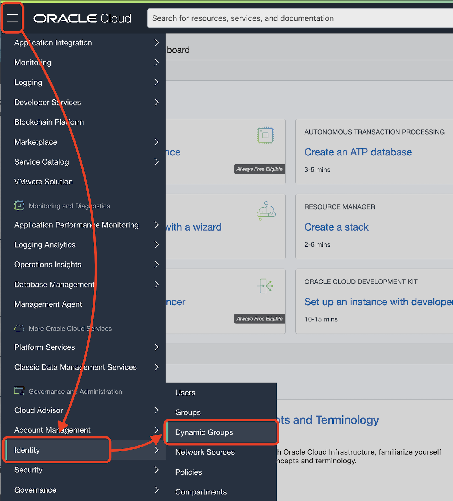
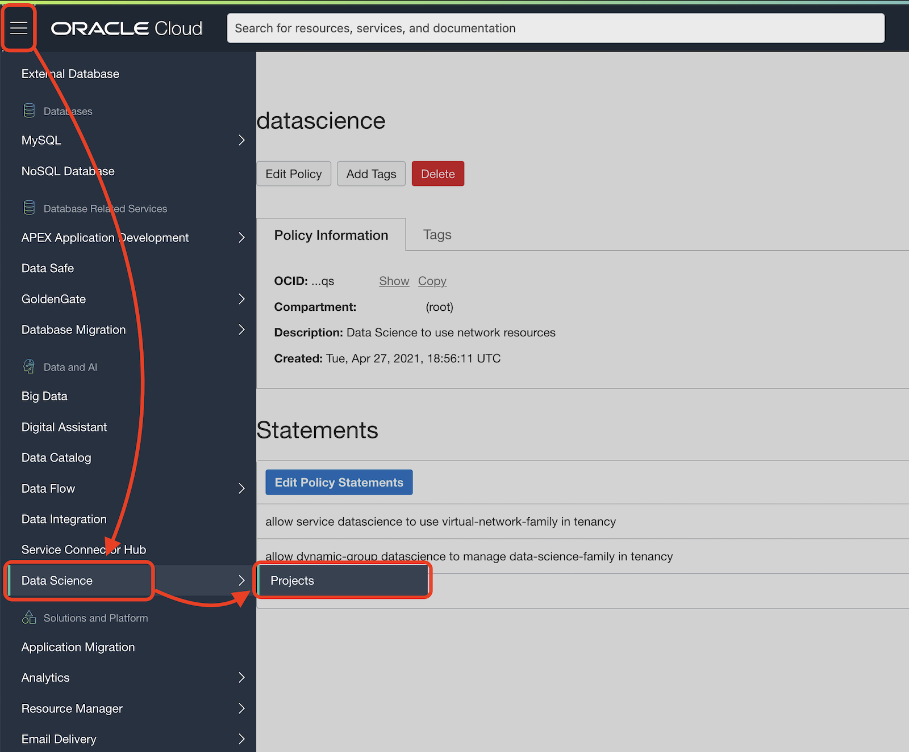
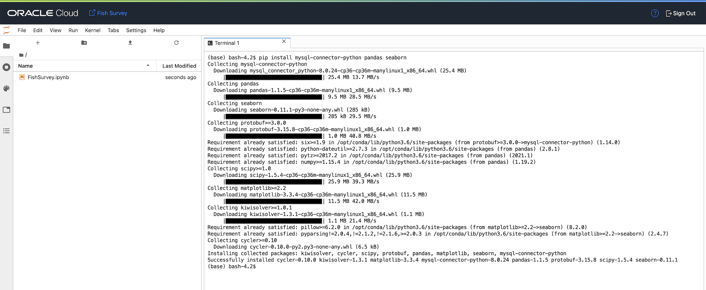
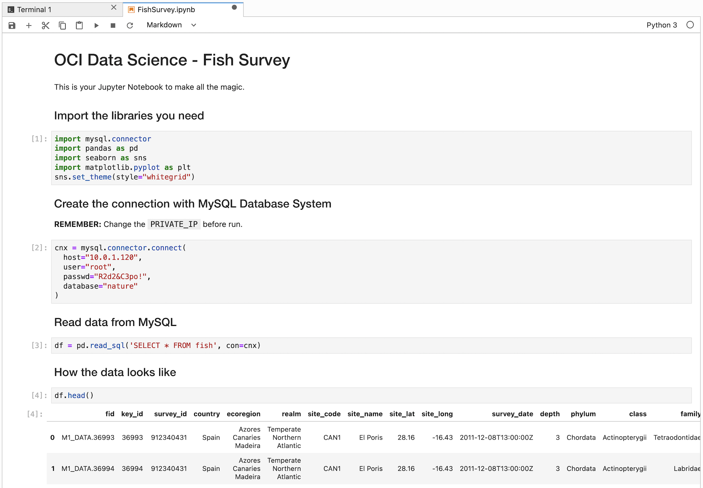
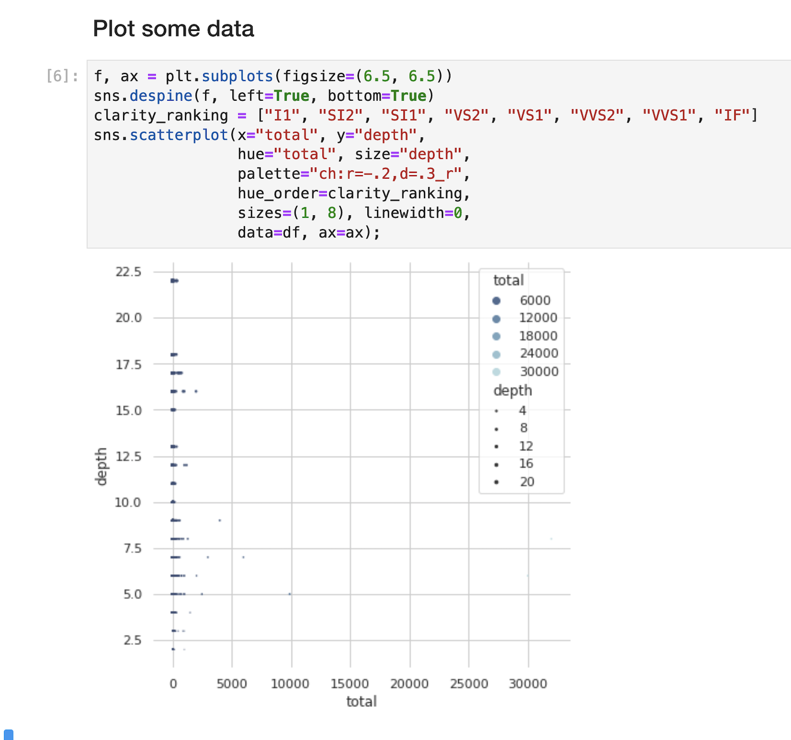

# Lab 5: Transform your Data into Insights


**Oracle Data Science**: Build high-quality models faster and easier. Automated machine learning capabilities rapidly examine the data and recommend the optimal data features and best algorithms. Additionally, automated machine learning tunes the model and explains the model’s results.

## Create Policies

Create Dynamic Group, go to **Menu** > **Identity & Security** > **Dynamic Groups**.



Click **Create Dynamic Group**.


Set the following values:

Name:
```
datascience
```

Description:
```
Data Science Dynamic Group
```

Rule 1 (Matching Rules):
```
ALL { resource.type = 'datasciencenotebooksession' }
```

Click **Create**.


The Dynamic Group for Data Science has been created.


---

Create Policies for Data Science:

Go to **Menu** > **Identity & Security** > **Policies**.


Click **Create Policy**.

Make sure you are in the `root` compartment.


Use the following information:

Name:
```
datascience
```

Description:
```
Data Science to use network resources
```

Toggle **Show manual editor**

Policy Builder:
```
allow service datascience to use virtual-network-family in tenancy
allow dynamic-group datascience to manage data-science-family in tenancy
```

Click **Create**.


The Policy for Data Science has been created.


> If you have created an Oracle Cloud Account to do the workshop, you are already the Administrator. You DO NOT NEED TO DO THIS STEP.
> 
> In case you are a Non-admin user, you will need to set up some more policies to allow the group you belong to. Ask your administrator.
> 
> ```
> allow group <data-scientists> to use virtual-network-family in tenancy
> allow group <data-scientists> to manage data-science-family in tenancy
> ```

---

## Create a Data Science Project

Go to **Menu** > **Analytics & AI** > **Data Science**.



Click **Create Project**.


Set the name and description as follows:

Name: 
```
Nature
```

Description: 
```
Fish Survey notebook
```

Click **Create**.


The next step is to create a Notebook, click **Create Notebook Session**.


Set the following values:

Name: 

```
Fish Survey
````

Compute Instance Shape (but other compatible shapes would work as well): 

```
VM.Standard.E2.2
```

Block Storage Size: 

```
50
````

VCN: 

```
nature
````

Subnet: 

```
Private Subnet-nature
````

Click **Create**.


The status icon will change from Creating to Active:


When the Notebook is active, click **Open**.


Log-in into your Notebook. Click **Continue** and you should be in your notebook as you are using your same OCI Web Console user. Otherwise, log in with your specific user.


---

## Install libraries

Welcome to your Jupyter Notebook, click **Terminal**.


And type the following command:

```
pip install mysql-connector-python pandas seaborn
```


Wait for the installation to complete.

---

## Create Jupyter Notebook environment

Download the Notebook [here](https://raw.githubusercontent.com/vmleon/mysql-dataintegrator-datascience-workshop/main/lab5/files/FishSurvey.ipynb).

Click **Upload files**.


Select `FishSurvey.ipynb` from your disk. Wait for the upload to complete.

Your `FishSurvey.ipynb` will be loaded on the side panel.



Double click on **FishSurvey.ipynb**.

Make sure you modify `PRIVATE_IP` on the following code in the Notebook with the Private IP from your MySQL Database System.

```
cnx = mysql.connector.connect(
  host="PRIVATE_IP",
  user="root",
  passwd="R2d2&C3po!",
  database="nature"
)
```


Select the rest paragraph (called Cell) of the Notebook and run the Notebook cell by cell by clicking the **play** icon over and over until you reach the end.



Check the plot.



## Congratulations! Well done!

Continue to the Next Steps for more information!

---

[**<< Go to Lab 4**](../lab4/README.md) | [Home](../README.md) | [**Next Steps >>>>>**](../next/README.md)